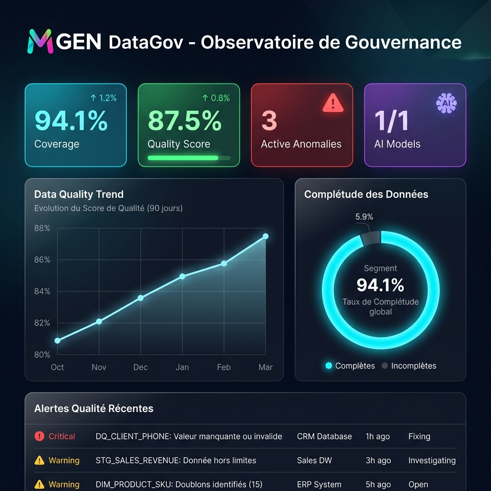
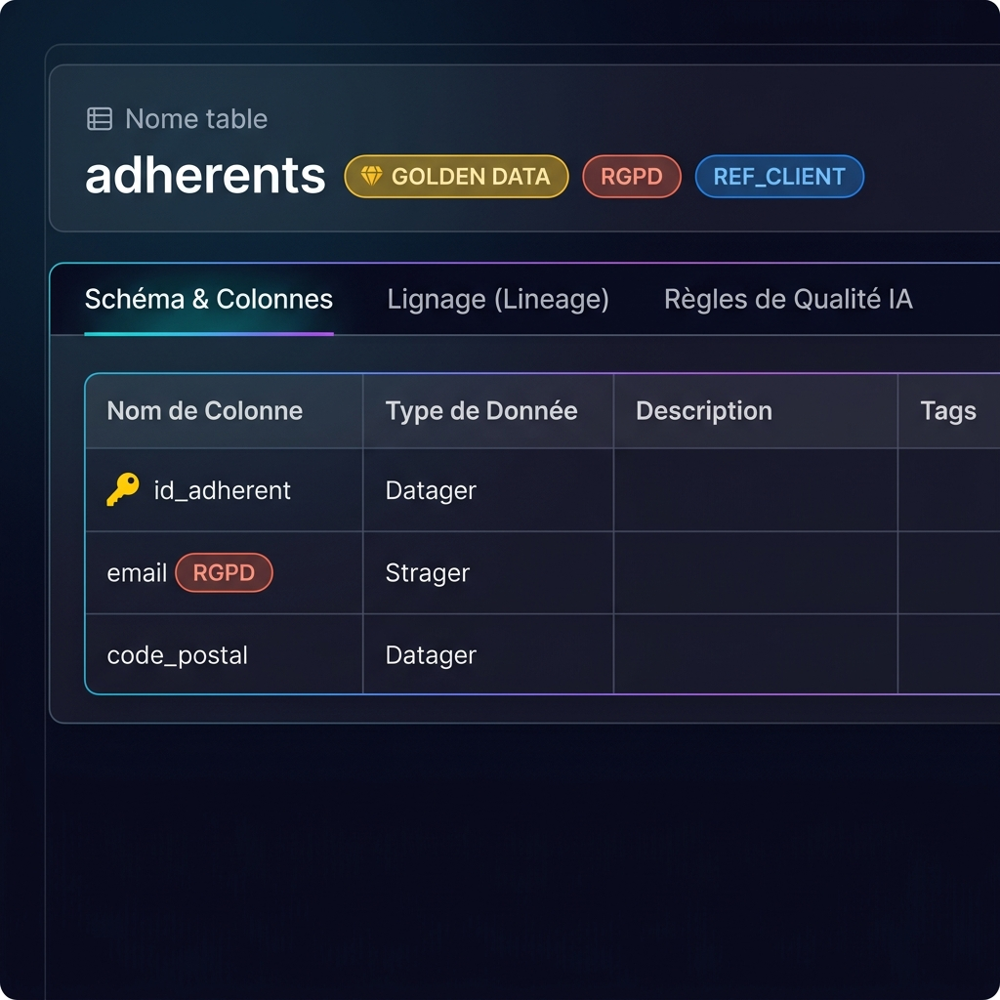
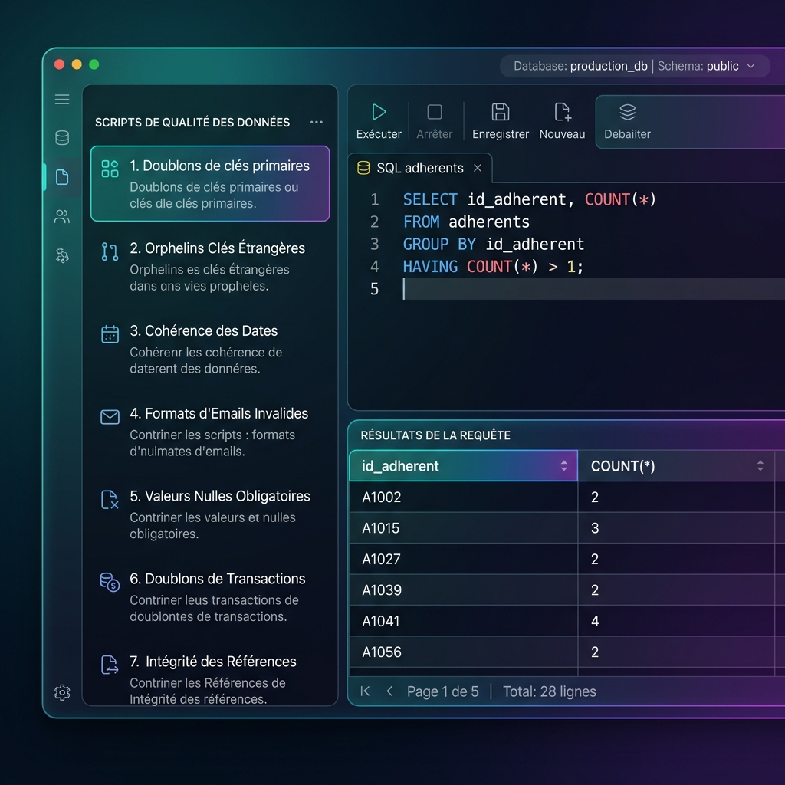
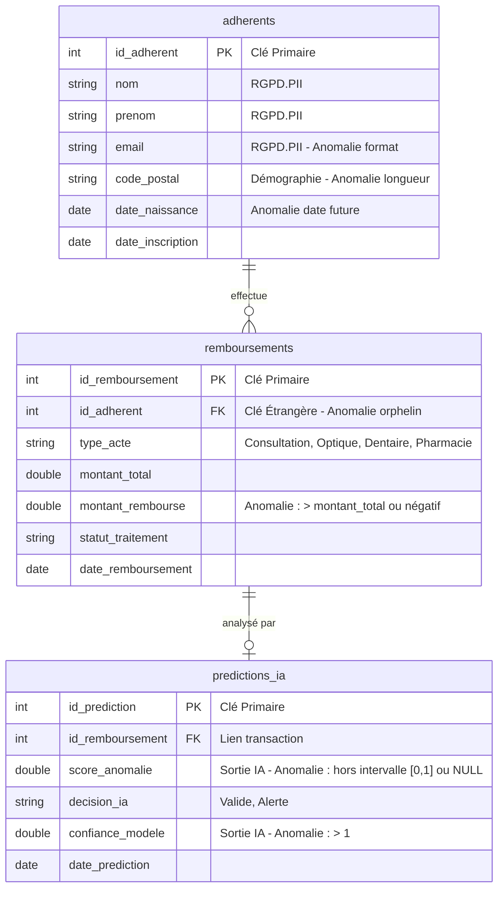

# MGEN - Portail de Gouvernance des Données & Qualité de Données pour l'IA

Ce projet a été conçu et réalisé dans le cadre de ma formation en data science pour comprendre le principe de la Data gouvernance et apporté une expérience de qualité, offrir de nouvelle ressource et de nouvelles méthodes d'approche dans la protection de données.
Il s'agit d'une application web interactive de niveau professionnel (Dashboard, Dictionnaire, SQL Console, Guide) démontrant de manière concrète mes compétences techniques et méthodologiques par rapport aux 3 piliers de la fiche de poste.


---

## 📸 Aperçu Visuel du Portail

<div align="center">
  <h3>Tableau de Bord de Gouvernance & Qualité IA</h3>
  
  
  <h3>Dictionnaire de Données (Style OpenMetadata)</h3>
  

  <h3>Playground SQL & Vérifications de Qualité</h3>
  
</div>

---

## 🎯 Alignement avec les Missions du Poste MGEN

Le portail est structuré en plusieurs modules correspondant précisément aux activités demandées :

### 1. Dictionnaire & Gouvernance (Style OpenMetadata)
- **Visualisation de Catalogue** : Présentation interactive de 3 tables clés de la mutuelle (`adherents`, `remboursements`, `predictions_ia`).
- **Enrichissement de métadonnées** : Intégration de descriptions précises, de propriétaires de données (*Data Owners*), et de tags de classification de sensibilité (ex. `RGPD.PII`) et de criticité (`Tier.GoldenData`).
- **Lignage de Données (Data Lineage)** : Traçabilité graphique des flux de données depuis les tables sources SQL jusqu'à la table analytique de sortie alimentant les prédictions d'IA.

### 2. Data Quality for AI (Vérification des "Golden Data")
- **Identification des Golden Data** : Marquage des tables sources critiques qui entraînent les modèles d'IA.
- **Registre d'assertions de qualité** : Implémentation de tests de qualité automatisés sur les entrées et sorties des modèles d'IA (unicité des identifiants, validité des formats, cohérence des montants, intégrité référentielle).
- **Simulation d'anomalies réalistes** : Le jeu de données factice contient des anomalies réelles et ciblées (e-mails incorrects, montants de remboursements supérieurs aux frais facturés, scores d'anomalies de l'IA supérieurs à 1) pour illustrer des scénarios réels de remédiation.

### 3. Accompagnement des Utilisateurs & Compétences SQL
- **Console SQL Interactive (Playground)** : Console SQLite embarquée dans le navigateur (propulsée par AlaSQL). Elle permet d'exécuter des requêtes en temps réel pour valider les métriques de qualité.
- **Centre de formation OpenMetadata** : Un guide utilisateur interactif rédigé par mes soins, expliquant comment ingérer, documenter, tager et configurer les alertes de qualité. Il démontre ma capacité de communication et de vulgarisation technique.

---

## 📊 Modèle de Données et Anomalies Injectées (Scénarios de Test)

La base de données en mémoire simule trois tables clés du domaine de la mutuelle santé :



### Exemples d'anomalies injectées pour tester les requêtes SQL :
1. **Doublon d'identifiant** : L'adhérent `Chloé Rousseau (id: 1007)` est inséré deux fois (échec de clé primaire).
2. **Orphelin référentiel** : Un remboursement lié à un `id_adherent` inexistant (`9999`) (échec de clé étrangère).
3. **Anomalie financière** : Un acte dentaire avec un remboursement supérieur aux frais réels, et un autre avec un montant négatif.
4. **Bug modèle IA** : Une ligne de prédiction avec un score d'anomalie de `1.50` (hors de l'intervalle `[0, 1]`).

---

## 🚀 Comment exécuter le projet localement ?

1. Clonez ce dépôt ou téléchargez les fichiers.
2. Ouvrez simplement le fichier `index.html` dans n'importe quel navigateur (Chrome, Firefox, Edge, Safari).
3. **Aucune installation de base de données ou de serveur n'est requise** : toutes les librairies (AlaSQL, Chart.js, FontAwesome) sont chargées via CDN et la base s'initialise entièrement en mémoire.

---

## 🛠️ Déploiement sur GitHub Pages

Pour rendre ce projet accessible aux recruteurs via une URL publique `https://votre-pseudo.github.io/mgen-data-governance-portal/` :

1. Créez un nouveau dépôt public sur votre GitHub nommé `mgen-data-governance-portal`.
2. Ouvrez un terminal dans le répertoire du projet et exécutez les commandes suivantes :
   ```bash
   git init
   git add .
   git commit -m "Initial commit: Portail de Gouvernance MGEN"
   git branch -M main
   git remote add origin https://github.com/jeoram/mgen-data-governance-portal.git
   git push -u origin main
   ```
3. Sur votre dépôt GitHub, allez dans **Settings** > **Pages**.
4. Sous **Build and deployment** > **Branch**, sélectionnez `main` (et le dossier `/ (root)`), puis cliquez sur **Save**.
5. Votre site sera en ligne dans les 2 minutes !
